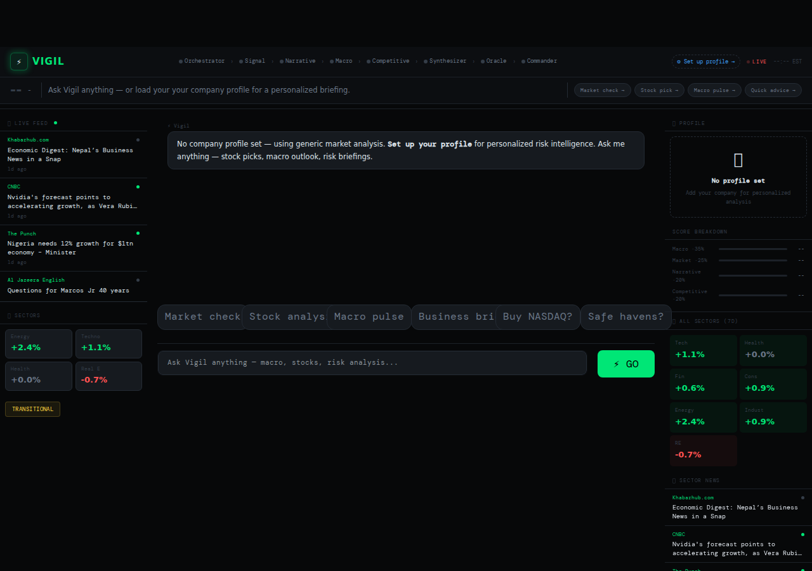

# ⚡ VIGIL — Multi-Agent Financial Risk Intelligence

[](https://www.python.org)
[](https://fastapi.tiangolo.com)
[](AGENTS.md)
[](https://lablab.ai)
[](LICENSE)

**8 specialized AI agents, orchestrated in waves inside a single process, turn live
market data into a scored, tiered, actionable risk briefing — personalized to your
company profile.**

Born at the Complete AI Agent Hackathon on lablab.ai (**Top-10 finalist**), then
rebuilt from a 9-service deployment into a clean single-process app you can run
with one command.



---

## What it does

**For founders & executives** — set up a company profile once (sector, stage,
regulations, active decisions). Ask anything: *"How exposed are we this quarter?"*,
*"Should I delay the raise?"*, *"What if the ECB hikes again?"* Vigil routes the
question through its agent pipeline and returns a risk score (0–100), a tier
(GREEN → DARK RED), the top 3 risks, and a prioritized action list.

**For anyone** — no setup needed. Ask Market Oracle a plain-English investment
question (*"Should I buy NASDAQ stocks right now?"*) and get a
**BUY / WAIT / CAUTION / AVOID** perspective with the bull case, bear case, and a
historical parallel.

> ⚠️ **Honest disclaimer:** Vigil's briefings are LLM-generated analysis grounded in
> live market data — perspective to help you think, **not** certified financial
> advice, and not a source of verified facts. Always validate before acting.

---

## Architecture

One FastAPI process. No microservices, no message queue, no framework lock-in —
the agents are prompts + a routing table, executed in dependency-ordered waves.

```
Browser ──► main.py (FastAPI, one port)
               │  asyncio.to_thread
               ▼
        agent_pipeline.run_pipeline(message, profile, history)
               │
               ├─ 1. ORCHESTRATOR ── classifies intent (7 types), routes the waves
               │
               ├─ 2. Wave 1: SIGNAL HARVESTER ─── frames live data (yfinance + NewsAPI)
               │
               ├─ 3. Wave 2 (parallel, ThreadPoolExecutor):
               │       NARRATIVE INTEL ∥ MACRO WATCHDOG ∥ COMPETITIVE INTEL
               │
               ├─ 4. Wave 3: RISK SYNTHESIZER ─── composite score 0–100 + tier + top risks
               │
               └─ 5. Wave 4: STRATEGY COMMANDER / MARKET ORACLE ── actions or verdict
               
        Result: score · tier · verdict · top 3 risks · 3 actions · full playbook
```

| Intent | Agents activated | Example query |
|--------|-----------------|---------------|
| `FULL_BRIEFING` | 7 (Wave 2 in parallel) | "Give me a complete risk briefing" |
| `MACRO_FOCUS` | Signal, Macro, Synthesizer, Commander | "What's the macro outlook for us?" |
| `COMPETITIVE_FOCUS` | Signal, Competitive, Synthesizer, Commander | "Competitive landscape?" |
| `DECISION_SUPPORT` | Signal, Macro, Synthesizer, Commander | "Should I delay Series A?" |
| `SCENARIO` | Signal, Macro, Synthesizer, Commander | "ECB rate hike scenario" |
| `INVESTMENT_QUERY` | Signal, Oracle | "Should I buy gold?" |
| `MARKET_PULSE` | Signal, Narrative, Synthesizer (brief) | "Quick market check" |

The full agent reference (roles, prompts, activation matrix) is in [AGENTS.md](AGENTS.md).

**Design principles:**
- **The engine is a pure function** — `(message, profile, history) → result dict`.
  No web framework, no session state inside it. `main.py` owns persistence.
- **Provider-agnostic** — any OpenAI-compatible endpoint. Claude models by default
  via AIML API; point `LLM_BASE_URL`/`LLM_API_KEY` anywhere.
- **Honest degradation** — no API key? The app still boots, live market data still
  flows, and chat says plainly that agents are unavailable. Vigil never fabricates
  analysis.

---

## Quick start

```bash
git clone https://github.com/muhammadtalhaishtiaq/vigil.git && cd vigil
pip install -r requirements.txt
cp .env.example .env        # add your keys (see below)
uvicorn main:app --port 3000
```

Open **http://localhost:3000** — that's the whole deployment.

### Environment variables

| Variable | Required | Notes |
|----------|----------|-------|
| `AIML_API_KEY` | For agent analysis | [aimlapi.com](https://aimlapi.com) — free tier available |
| `LLM_BASE_URL` + `LLM_API_KEY` | Alternative to the above | Any OpenAI-compatible endpoint |
| `VIGIL_MODEL` | No | Force one model for all 8 agents |
| `NEWSAPI_KEY` | For live headlines | [newsapi.org](https://newsapi.org/register) — free tier: 100 req/day |
| `SECRET_KEY` | No | Session-cookie signing (ephemeral if unset) |

yfinance market data (prices, VIX, sectors) needs **no key**.

### Health check

```bash
python health_check.py        # verifies NewsAPI, yfinance, LLM endpoint
curl localhost:3000/health    # runtime status incl. key configuration
```

---

## Project structure

```
vigil/
├── main.py               # FastAPI app — pages, session APIs, runs the engine
├── agent_pipeline.py     # The 8-agent engine (pure function, wave orchestration)
├── data_layer.py         # Live market data: yfinance + NewsAPI, 60s cache
├── session_store.py      # JSON-backed session persistence (gitignored at runtime)
├── prompts/              # One system prompt per agent (8 files)
├── static/ + vigil-*.html# Vanilla JS/CSS frontend — no build step
├── docs/REVAMP_PLAN.md   # The audit + rebuild plan this repo followed
├── AGENTS.md             # Full agent documentation
└── health_check.py       # Pre-flight connectivity check
```

---

## Known limitations

- **NewsAPI free tier** caps at 100 requests/day — headlines degrade gracefully to
  cached/absent beyond that.
- **Risk scores are model-generated estimates**, not calibrated probabilities. The
  next planned iteration grounds every risk in cited sources.
- Session auth is cookie-based without login — built for single-user/demo use.

## From hackathon to here

The hackathon version ran 8 agents as separate FastAPI microservices on 9 ports.
This repo is the deliberate rebuild: same agent design, collapsed into one process,
fake demo fallbacks removed, claims aligned with code. The full audit and the
decision log live in [docs/REVAMP_PLAN.md](docs/REVAMP_PLAN.md).

## License

MIT — see [LICENSE](LICENSE).

Built by [Muhammad Talha](https://github.com/muhammadtalhaishtiaq) ·
Top-10 finalist, Complete AI Agent Hackathon on [lablab.ai](https://lablab.ai)
